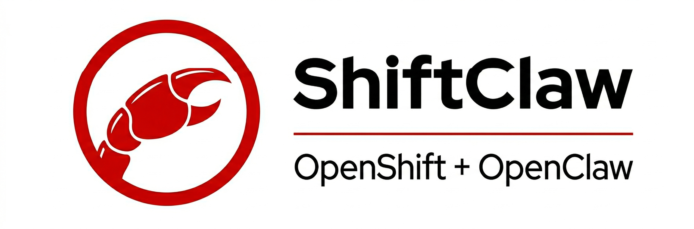

# ShiftClaw

<p align="center">
  
</p>

> OpenClaw deployment for OpenShift: UBI 10 · Node.js 24 · OpenRouter · Telegram

[](https://github.com/openclaw/openclaw)
[](https://catalog.redhat.com/software/containers/ubi10/nodejs-24-minimal)
[](https://nodejs.org)
[](https://www.redhat.com/en/technologies/cloud-computing/openshift)
[](LICENSE)

This repository contains everything needed to run [OpenClaw](https://github.com/openclaw/openclaw) as a Pod on an OpenShift/OKD cluster. The custom container image is built on **Red Hat UBI 10 + Node.js 24** (not Debian, not Ubuntu), hardened by default, and published to GHCR via GitHub Actions.

The deployment is managed through Telegram — no Ingress or Route is needed.

---

## Prerequisites

- `oc` configured against your cluster
- An [OpenRouter](https://openrouter.ai) API key
- A Telegram bot token from [@BotFather](https://t.me/BotFather)
- A GitHub account to push the container image to GHCR

---

## Deploy

### 1 — Build and push the image

Push to `main` (or tag a release) and GitHub Actions will build the image and publish it to `ghcr.io/rarguello/shiftclaw`. No manual `podman build` needed.

Then update the image reference in `manifests/statefulset.yaml`:

```yaml
image: ghcr.io/rarguello/shiftclaw:2026.4.10
```

### 2 — Create the Secret

Never commit real credentials. Create a local `.env` file (already in `.gitignore`):

```
OPENROUTER_API_KEY=sk-or-...
TELEGRAM_BOT_TOKEN=123456:ABC-...
OPENCLAW_GATEWAY_TOKEN=$(openssl rand -hex 32)
```

Apply it to the cluster:

```bash
oc create secret generic shiftclaw --from-env-file=.env --namespace=shiftclaw
```

### 3 — Apply the manifests

```bash
oc apply -f manifests/
```

This creates the namespace, ServiceAccount, ConfigMap, StatefulSet (with its PVC), NetworkPolicy, PodDisruptionBudget, and Service in one shot.

### 4 — Verify

```bash
oc get pods -n shiftclaw -w
oc logs -l app.kubernetes.io/name=shiftclaw -n shiftclaw -f
```

### 5 — Approve the Telegram bot

On first start, OpenClaw requires manual approval of the Telegram channel pairing. Open a shell into the running pod and run:

```bash
oc exec -it shiftclaw-0 -n shiftclaw -- sh
openclaw pairing approve telegram <PAIRING_CODE>
```

The pairing code appears in the pod logs. Once approved the bot starts responding and the approval is persisted on the PVC — it does not need to be repeated on restart.

---

## Access

ShiftClaw is managed through Telegram — just talk to your bot. No Route or Ingress is required.

If you need local access to the WebSocket gateway (port 18789):

```bash
oc port-forward pod/shiftclaw-0 18789:18789 -n shiftclaw
```

---

## Configuration

| File | Purpose |
|------|---------|
| `config/openclaw.json` | Non-sensitive runtime config — model, channels, agent defaults |
| `manifests/secret.yaml.template` | Documents the expected Secret structure |
| `manifests/serviceaccount.yaml` | Dedicated ServiceAccount (no default SA token mounted) |
| `manifests/networkpolicy.yaml` | Default-deny ingress; egress limited to DNS + HTTPS only |
| `manifests/poddisruptionbudget.yaml` | Signals voluntary-disruption intent to the scheduler |
| `manifests/statefulset.yaml` | StatefulSet — resource limits, probes, security context, PVC template |
| `.github/workflows/build.yaml` | OpenClaw version pin and image build settings |

Edit `config/openclaw.json` to change the model, enable/disable channels, or tune agent parameters.

The config is seeded from the ConfigMap **only on first start** — OpenClaw edits its own config at runtime and those changes are preserved across restarts. To apply a ConfigMap change to a running deployment, delete the live config from the PVC so the init container re-seeds it on next start:

```bash
# 1 — Update the ConfigMap
oc create configmap shiftclaw-config \
  --from-file=openclaw.json=config/openclaw.json \
  --namespace=shiftclaw \
  --dry-run=client -o yaml | oc apply -f -

# 2 — Delete the live config so the init container re-seeds it
oc exec shiftclaw-0 -n shiftclaw -- rm /var/lib/openclaw/openclaw.json

# 3 — Restart
oc rollout restart statefulset/shiftclaw -n shiftclaw
```

---

## Upgrading OpenClaw

1. Update `OPENCLAW_VERSION` in `.github/workflows/build.yaml`
2. Update the `image:` tag in `manifests/statefulset.yaml`
3. Push — CI builds and publishes the new image automatically
4. `oc apply -f manifests/statefulset.yaml` (or `oc apply -k manifests/`)

---

## Security

The container image and Pod spec follow a secure-by-default posture:

- Non-root process (`runAsNonRoot: true`) — OpenShift SCC assigns the UID
- Read-only root filesystem (`readOnlyRootFilesystem: true`)
- All Linux capabilities dropped (`capabilities: drop: ALL`)
- Default seccomp profile (`seccompProfile: RuntimeDefault`)
- No privilege escalation (`allowPrivilegeEscalation: false`)
- Dedicated ServiceAccount with no token mounted (`automountServiceAccountToken: false`)
- NetworkPolicy: default-deny ingress; egress limited to DNS (53) + HTTPS (443)
- Secrets never baked into the image — injected at runtime via K8s Secret
- Every image build is scanned with Trivy; CRITICAL CVEs fail the pipeline
- SBOM and provenance attestations generated on every push

---

## Running as a systemd user service (Quadlet)

This is the recommended way to run ShiftClaw persistently on a Linux desktop or server — no OpenShift required, no root required.

Quadlet is a Podman feature (4.4+) that lets systemd manage containers directly. You write a `.container` file and systemd handles start, stop, and restart.

### Prerequisites

Same as the local Podman section below: an OpenRouter API key, a Telegram bot token, and Podman installed. No `sudo` needed for any of these steps.

### 1 — Seed the state directory (one-time)

```bash
mkdir -p ~/.local/share/shiftclaw
cp config/openclaw.json ~/.local/share/shiftclaw/openclaw.json
```

OpenClaw will manage this file at runtime. You only need to copy it once — if the file already exists it will not be overwritten.

### 2 — Create the env file (one-time)

```bash
mkdir -p ~/.config/shiftclaw
cp .env.example ~/.config/shiftclaw/env
```

Open `~/.config/shiftclaw/env` and fill in your real values. This file lives outside the project directory so there is no risk of accidentally committing it.

### 3 — Install the Quadlet file

```bash
mkdir -p ~/.config/containers/systemd
cp shiftclaw.container ~/.config/containers/systemd/
```

### 4 — Enable linger

Linger allows your user services to start at boot and keep running after you log out. Run this as your regular user — no `sudo`:

```bash
loginctl enable-linger
```

### 5 — Start the service

```bash
systemctl --user daemon-reload
systemctl --user enable --now shiftclaw
```

### Useful commands

```bash
# Follow logs
journalctl --user -u shiftclaw -f

# Approve the Telegram pairing (first start only)
podman exec shiftclaw openclaw pairing approve telegram <PAIRING_CODE>

# Stop / restart
systemctl --user stop shiftclaw
systemctl --user restart shiftclaw
```

---

## Using OpenAI Codex (ChatGPT subscription, no API key)

If you have a ChatGPT Plus, Pro, or Team subscription you can use OpenAI Codex directly — no OpenAI API key or per-token billing required. OpenClaw authenticates via OAuth using your existing ChatGPT account.

### 1 — Log in

Run this inside the container (it must be running):

```bash
podman exec -it shiftclaw openclaw models auth login --provider openai-codex
```

OpenClaw prints an OAuth URL. Open it in your browser, log in with your ChatGPT account, and authorize the app. The browser will then redirect to a `http://localhost:1455/...` URL — copy that full URL from the address bar and paste it back into the terminal where you ran the `podman exec` command. The credentials are saved to your state directory and persist across restarts — you only need to do this once.

### 2 — Set Codex as the default model

```bash
podman exec -it shiftclaw openclaw models set openai-codex/gpt-5.4
```

### 3 — Verify

```bash
podman exec -it shiftclaw openclaw models status --plain
```

It should show `openai-codex/gpt-5.4` as the active model. Send a message to your Telegram bot to confirm.

> **Note:** OpenClaw manages the live config file at runtime. The `config/openclaw.json` in this repo is only used to seed the state directory on first run — it will be out of sync after OpenClaw writes its own changes, which is expected.

---

## Testing locally with Podman

You don't need an OpenShift cluster to try ShiftClaw. This section walks through everything from scratch.

### Prerequisites

**1. OpenRouter API key**

OpenRouter gives the bot access to AI models (Gemini, Claude, Llama, etc.).

1. Create a free account at [openrouter.ai](https://openrouter.ai)
2. Go to **Keys** → **Create key**
3. Copy the key — it starts with `sk-or-`

**2. Telegram bot token**

1. Open Telegram and search for **@BotFather**
2. Send `/newbot`
3. Choose a display name (e.g. `My ShiftClaw Bot`) and a username ending in `bot` (e.g. `myshiftclaw_bot`)
4. BotFather replies with a token like `123456789:ABCdef...` — copy it

**3. Podman**

Install Podman for your OS: [podman.io/docs/installation](https://podman.io/docs/installation)

---

### 1 — Create your `.env` file

```bash
cp .env.example .env
```

Open `.env` and replace the placeholder values:

```
OPENROUTER_API_KEY=sk-or-...
TELEGRAM_BOT_TOKEN=123456789:ABCdef...
OPENCLAW_GATEWAY_TOKEN=any-random-string
```

Each variable is explained in the `.env.example` file.

---

### 2 — Build the image locally (optional)

If you want to test your own code changes instead of the published image:

```bash
podman build -t localhost/shiftclaw:dev .
```

Skip this step if you just want to run the published image.

---

### 3 — Run the container

```bash
# Using the published image:
./run.sh

# Using your locally built image:
./run.sh localhost/shiftclaw:dev
```

The script:
- Seeds `~/.local/share/shiftclaw/` with `config/openclaw.json` on the first run
- Mounts that directory persistently so state survives restarts
- Loads your secrets from `.env`
- Exposes the gateway on `http://localhost:18789`

On first run Podman will pull the image — this takes a minute. After that you should see log lines ending with `[gateway] ready`.

---

### 4 — Approve the Telegram pairing

The first time the bot starts it prints a pairing code in the logs:

```
[telegram] pairing code: 123456
```

Approve it by running this in a second terminal (container must be running):

```bash
podman exec shiftclaw openclaw pairing approve telegram 123456
```

The approval is saved to `~/.local/share/shiftclaw/` and is not needed again after a restart.

---

### 5 — Talk to your bot

Open Telegram, find the bot you created with BotFather, and send it a message. That's it.

To stop the container press `Ctrl+C` in the terminal where `run.sh` is running.

---

## License

MIT — same as [OpenClaw upstream](https://github.com/openclaw/openclaw).
Red Hat, OpenShift, and UBI are trademarks of Red Hat, Inc.
