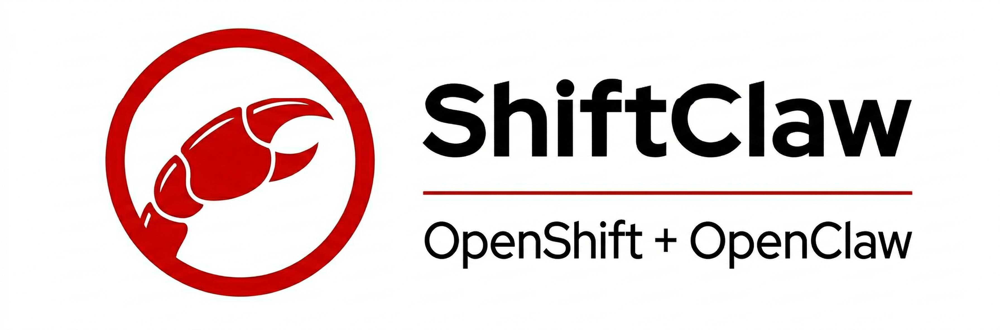

# ShiftClaw

<p align="center">
  
</p>

> OpenClaw deployment for OpenShift: UBI 10 · Node.js 24 · OpenRouter · Telegram

[](https://github.com/openclaw/openclaw)
[](https://catalog.redhat.com/software/containers/ubi10/nodejs-24-minimal)
[](https://nodejs.org)
[](https://www.redhat.com/en/technologies/cloud-computing/openshift)
[](LICENSE)

Runs [OpenClaw](https://github.com/openclaw/openclaw) as a Pod on OpenShift/OKD, or as a systemd/Podman Quadlet on a Linux host with systemd and Podman. Built on Red Hat UBI 10 + Node.js 24 (not Debian, not Ubuntu), hardened by default, published to GHCR via GitHub Actions.

Agent interaction is through Telegram — no Ingress or Route needed.

---

## Prerequisites

- `oc` configured against your cluster
- An [OpenRouter](https://openrouter.ai) API key
- A Telegram bot token from [@BotFather](https://t.me/BotFather)
- A GitHub account to push the container image to GHCR

---

## Deploy

### 1 — Build and push the image

Push to `main` (or tag a release); GitHub Actions builds and publishes to `ghcr.io/rarguello/shiftclaw`.

Update the image reference in `manifests/statefulset.yaml`:

```yaml
image: ghcr.io/rarguello/shiftclaw:2026.6.34
```

### 2 — Create the namespace and Secret

Create a local `.env` file (gitignored). `oc create secret --from-env-file` reads it literally — generate the gateway token first, then paste the value in:

```bash
openssl rand -hex 32
```

```
OPENROUTER_API_KEY=sk-or-...
TELEGRAM_BOT_TOKEN=123456:ABC-...
OPENCLAW_GATEWAY_TOKEN=<paste the generated value>
```

```bash
oc apply -f manifests/namespace.yaml
oc create secret generic shiftclaw --from-env-file=.env --namespace=shiftclaw
```

### 3 — Apply the manifests

```bash
oc apply -k manifests/
```

Creates the ServiceAccount, ConfigMap, StatefulSet, NetworkPolicy, PodDisruptionBudget, and Service. `secret.yaml` is excluded from `kustomization.yaml` on purpose — it's never committed.

### 4 — Verify

```bash
oc get pods -n shiftclaw -w
oc logs -l app.kubernetes.io/name=shiftclaw -n shiftclaw -f
```

### 5 — Approve the Telegram bot

First start requires approving the Telegram pairing:

```bash
oc exec -it shiftclaw-0 -n shiftclaw -- sh
openclaw pairing approve telegram <PAIRING_CODE>
```

Pairing code is in the pod logs. Persisted on the PVC — one-time only.

---

## Access

Agent interaction is through Telegram. For local access to the gateway (port 18789):

```bash
oc port-forward pod/shiftclaw-0 18789:18789 -n shiftclaw
```

---

## Configuration

| File | Purpose |
|------|---------|
| `config/openclaw.json` | Non-sensitive runtime config — model, channels, agent defaults |
| `manifests/secret.yaml.template` | Documents the expected Secret structure |
| `manifests/serviceaccount.yaml` | Dedicated ServiceAccount (no default SA token mounted) |
| `manifests/networkpolicy.yaml` | Default-deny ingress; egress limited to DNS + HTTPS only |
| `manifests/poddisruptionbudget.yaml` | Signals voluntary-disruption intent to the scheduler |
| `manifests/statefulset.yaml` | StatefulSet — resource limits, probes, security context, PVC template |
| `package.json` | Pins the OpenClaw npm version the build reads (Dependabot tracks this) |

Edit `config/openclaw.json` to change the model, enable/disable channels, or tune agent parameters.

Config is seeded from the ConfigMap on first start only — OpenClaw owns it at runtime after that. To apply a ConfigMap change, delete the live config so the init container re-seeds it:

```bash
oc create configmap shiftclaw-config \
  --from-file=openclaw.json=config/openclaw.json \
  --namespace=shiftclaw \
  --dry-run=client -o yaml | oc apply -f -

oc exec shiftclaw-0 -n shiftclaw -- rm /var/lib/openclaw/openclaw.json
oc rollout restart statefulset/shiftclaw -n shiftclaw
```

---

## Upgrading OpenClaw

1. Update the `openclaw` version in `package.json` (or merge the Dependabot PR) — this is what the build actually reads
2. Push — CI builds, boot-tests, scans, and publishes automatically; `latest` only moves once all three pass
3. Update the version string everywhere else it's referenced for documentation/deployment purposes: `manifests/statefulset.yaml` (both `image:` fields), `shiftclaw.container`, `run.sh`, and the README badge/examples
4. `oc apply -k manifests/`

---

## Security

- Non-root process (`runAsNonRoot: true`) — OpenShift SCC assigns the UID
- Read-only root filesystem (`readOnlyRootFilesystem: true`)
- All Linux capabilities dropped (`capabilities: drop: ALL`)
- Default seccomp profile (`seccompProfile: RuntimeDefault`)
- No privilege escalation (`allowPrivilegeEscalation: false`)
- Dedicated ServiceAccount with no token mounted (`automountServiceAccountToken: false`)
- NetworkPolicy: default-deny ingress; egress limited to DNS (5353/UDP to openshift-dns) + HTTPS (443)
- Secrets never baked into the image — injected at runtime via K8s Secret
- Every image build is scanned with Trivy; CRITICAL CVEs fail the pipeline
- SBOM and provenance attestations generated on every push

---

## Running as a systemd user service (Quadlet)

Recommended for running ShiftClaw persistently outside OpenShift — no root required.

Quadlet (Podman 4.4+) lets systemd manage containers directly from a `.container` file.

### Prerequisites

Same as [Testing locally with Podman](#testing-locally-with-podman) below: OpenRouter API key, Telegram bot token, Podman installed.

### 1 — Seed the state directory (one-time)

```bash
mkdir -p ~/.local/share/shiftclaw
cp config/openclaw.json ~/.local/share/shiftclaw/openclaw.json
```

OpenClaw manages this file at runtime after the first copy.

### 2 — Create the env file (one-time)

```bash
mkdir -p ~/.config/shiftclaw
cp .env.example ~/.config/shiftclaw/env
```

Fill in real values. Lives outside the repo.

### 3 — Install the Quadlet file

```bash
mkdir -p ~/.config/containers/systemd
cp shiftclaw.container ~/.config/containers/systemd/
```

### 4 — Enable linger

Lets user services start at boot and survive logout:

```bash
loginctl enable-linger
```

### 5 — Start the service

```bash
systemctl --user daemon-reload
systemctl --user enable --now shiftclaw
```

The Quadlet tracks `:latest` and pulls on every restart. For it to update automatically, enable Podman's own timer:

```bash
systemctl --user enable --now podman-auto-update.timer
```

### Useful commands

```bash
# Follow logs
journalctl --user -u shiftclaw -f

# Approve the Telegram pairing (first start only)
podman exec shiftclaw openclaw pairing approve telegram <PAIRING_CODE>

# Stop / restart
systemctl --user stop shiftclaw
systemctl --user restart shiftclaw
```

---

## Using a ChatGPT subscription (no API key)

Use a ChatGPT Plus/Pro/Business subscription instead of API billing — OpenClaw authenticates via OAuth.

### 1 — Log in

Container must be running:

```bash
podman exec -it shiftclaw openclaw models auth login --provider openai
```

Open the printed URL, log in with your ChatGPT account, authorize. It redirects to a `http://localhost:1455/...` URL — copy that full URL back into the terminal. One-time; credentials persist in the state directory.

### 2 — Set it as the default model

```bash
podman exec -it shiftclaw openclaw config set agents.defaults.model.primary openai/gpt-5.5
```

### 3 — Verify

```bash
podman exec -it shiftclaw openclaw models list --provider openai
```

> `config/openclaw.json` only seeds state on first run — OpenClaw owns it afterward. Drift from the repo copy is expected.

---

## Testing locally with Podman

### Prerequisites

- **OpenRouter API key** — [openrouter.ai](https://openrouter.ai) → Keys → Create key (`sk-or-...`)
- **Telegram bot token** — message [@BotFather](https://t.me/BotFather), `/newbot`
- **Podman** — [podman.io/docs/installation](https://podman.io/docs/installation)

### 1 — Create your `.env` file

```bash
cp .env.example .env
```

Fill in the values (each is explained in `.env.example`):

```
OPENROUTER_API_KEY=sk-or-...
TELEGRAM_BOT_TOKEN=123456789:ABCdef...
OPENCLAW_GATEWAY_TOKEN=any-random-string
```

### 2 — Build the image locally (optional)

For local code changes:

```bash
podman build -t localhost/shiftclaw:dev .
```

### 3 — Run the container

```bash
# Published image:
./run.sh

# Locally built image:
./run.sh localhost/shiftclaw:dev
```

The script seeds `~/.local/share/shiftclaw/` with `config/openclaw.json`, mounts it persistently, loads secrets from `.env`, and exposes the gateway on `http://localhost:18789`. Look for `[gateway] ready` in the logs.

### 4 — Approve the Telegram pairing

First start prints a pairing code:

```
[telegram] pairing code: 123456
```

Approve it (container must be running):

```bash
podman exec shiftclaw openclaw pairing approve telegram 123456
```

Saved to state — one-time only.

### 5 — Talk to your bot

Message your bot in Telegram. `Ctrl+C` to stop.

---

## License

MIT — same as [OpenClaw upstream](https://github.com/openclaw/openclaw).
Red Hat, OpenShift, and UBI are trademarks of Red Hat, Inc.
